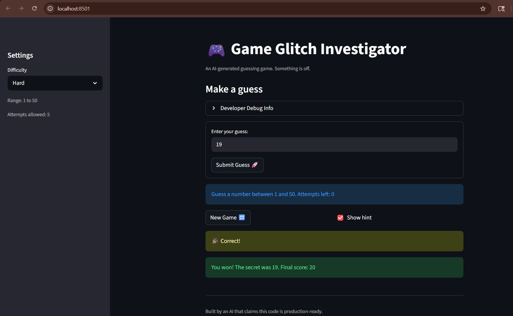

# 🎮 Game Glitch Investigator: The Impossible Guesser

## 🚨 The Situation

You asked an AI to build a simple "Number Guessing Game" using Streamlit.
It wrote the code, ran away, and now the game is unplayable. 

- You can't win.
- The hints lie to you.
- The secret number seems to have commitment issues.

## 🛠️ Setup

1. Install dependencies: `pip install -r requirements.txt`
2. Run the broken app: `python -m streamlit run app.py`

## 🕵️‍♂️ Your Mission

1. **Play the game.** Open the "Developer Debug Info" tab in the app to see the secret number. Try to win.
2. **Find the State Bug.** Why does the secret number change every time you click "Submit"? Ask ChatGPT: *"How do I keep a variable from resetting in Streamlit when I click a button?"*
3. **Fix the Logic.** The hints ("Higher/Lower") are wrong. Fix them.
4. **Refactor & Test.** - Move the logic into `logic_utils.py`.
   - Run `pytest` in your terminal.
   - Keep fixing until all tests pass!

## 📝 Document Your Experience

### Game Purpose
The Number Guessing Game is a Streamlit-based interactive game where players try to guess a secret number within a range determined by the selected difficulty level. The game provides hints ("go higher" or "go lower") after each guess, tracks the number of attempts remaining, updates a score, and allows players to replay by resetting state through the "New Game" button. It demonstrates core concepts like session state management, widget interaction, and Streamlit reruns.

### Bugs Found
Four critical bugs were identified:
1. **Reversed hint logic** – The `check_guess` function had inverted comparison messages: guessing lower than the secret said "go LOWER" instead of "go HIGHER".
2. **New Game button failure** – After winning or losing, the New Game button did not fully reset session state, making it impossible to start a fresh round without reloading the page.
3. **Stale attempt counter** – The info banner displayed inconsistent attempt counts; it might show "1 attempt left" while immediately showing "out of attempts" because it used an outdated state value.
4. **Difficulty setting ignored** – The sidebar correctly displayed the range for the selected difficulty, but the main prompt always showed 1–100 and generated secrets from 1–100 regardless of the difficulty chosen.

### Fixes Applied
1. **Refactored logic into `logic_utils.py`** – Moved `get_range_for_difficulty`, `parse_guess`, `check_guess`, and `update_score` into a separate util module with corrected implementations and proper docstrings.
2. **Fixed hint messages** – Corrected the comparison logic in `check_guess` to return the right hint direction ("go LOWER" when guess > secret, "go HIGHER" when guess < secret).
3. **Implemented form submission** – Wrapped the input and submit button in `st.form` so pressing Enter immediately submits the guess instead of requiring a double-click.
4. **Fixed state initialization and attempts display** – Changed initial attempts to 0, reset all state on New Game or difficulty change, and moved the info banner below the form so it reflects the current submit value.
5. **Added difficulty-aware secret generation** – Both New Game and difficulty-change logic now use the correct range from `get_range_for_difficulty`.
6. **Added comprehensive tests** – Created pytest cases in `tests/test_game_logic.py` covering all helper functions and added regression tests for each bug.

## 📸 Demo

- [ ] 

## 🚀 Stretch Features

- [ ] [If you choose to complete Challenge 4, insert a screenshot of your Enhanced Game UI here]
